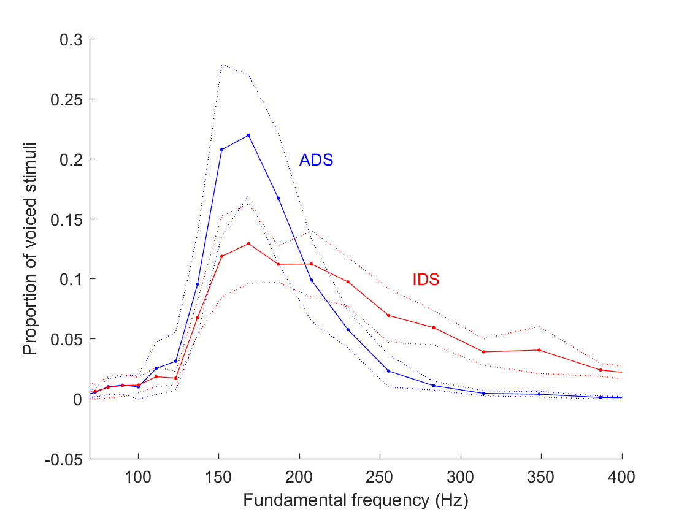

```{r load_packages_settings, include = FALSE}
library("papaja")
library(ggthemes)
library(lme4)
library(tidyverse)
library(here)
library(knitr)
library(kableExtra)
library(ggpubr)


opts_chunk$set(echo = FALSE, warning = FALSE, message = FALSE, cache = TRUE)
theme_set(theme_bw() + 
            theme(strip.background = element_blank(), 
                  panel.grid = element_blank())) # nice theme with limited extras
```

```{r load_authors}
# downloaded from https://docs.google.com/spreadsheets/d/1O225ib9wFjUjZJfz9jqwRkfFYaCGXrtDYnmkK9NM3r8/edit#gid=0 on 3/4/19
author_data <- read_csv(here("metadata/ManyBabies1 Author List and Contributions - Sheet1.csv"), 
                    skip = 5) %>% 
  rename(first = `Author First Name`, 
         last = `Author Last Name`,
         affil = Affiliation, 
         grant = `Grant acknowledgment(s)`, 
         concept = `Early Concept`, 
         design = `Study Design`,
         stim = `IDS/ADS Stimuli`, 
         pilot = `Ran Pilot`,
         protocol = `Protocol Code/Script`,
         doc = Documentation, 
         manage = `Study Management`,
         data = `Data Collection`,
         analysis = `Data Analysis`, 
         ms1 = `Stage 1 Manuscript`, 
         ms2 = `Stage 2 Manuscript`) %>% 
  select(first, last, affil, grant, concept:ms2) %>% 
  mutate(full = paste0(.$first, " ", .$last, " (", .$affil, ")"), 
         status = case_when(last == "Frank" ~ 1, 
                            last == "Soderstrom" ~ 3, 
                            TRUE ~ 2), 
         initials = paste0(gsub("[:a-zé\\öøł:\\.\\ \\-]","",first), gsub("[:a-zé\\öøł:\\.\\ \\-]","",last))) %>%
  group_by(status) %>% 
  arrange(last, .by_group = TRUE) 

authors <- author_data %>% 
  pull(full) %>% 
  paste(collapse = ", ")

grants <- author_data  %>% 
  filter(!is.na(grant), 
         grant != "Association for Psychological Science (APS)") %>%
  filter(!duplicated(grant)) %>%
  pull(grant) %>% 
  paste(collapse = "; ")
# Can't figure out how to render this into YAML, pasting for now.
```


```{r load_labs}
d_participants <- read_csv(here("processed_data/03_data_trial_main.csv"), 
                           na = c("NA", "N/A"))

labs <- d_participants %>%
  group_by(lab) %>%
  summarise(n = length(unique(subid)), 
            method = paste(unique(method), collapse = ", "))

n <- labs %>%
  pull(n) %>%
  sum

n_labs <- length(unique(labs$lab))

agegroups_lab <- d_participants %>%
  filter(!is.na(age_group)) %>%
  group_by(lab) %>%
  summarize(n = length(unique(age_group)))

n_labs_multiple_agegroups <- agegroups_lab %>%
  filter(n>1) %>%
  summarize(n=length(n)) %>%
  pull

```


The recent focus on power, replication, and replicability has had important consequences for many branches of psychology. Confidence in influential theories and classic psychological experiments has been shaken by demonstrations that much of the experimental literature is under-powered [@button2013power], that surprisingly few empirical claims have been subject to direct replication [@makel2012replications], and that the direct replication attempts that do occur often fail to substantiate original findings [@open2015estimating]. As disturbing as these demonstrations may be, they have already led to important positive consequences in psychology, encouraging scientific organizations, journals, and researchers to work to improve the transparency and replicability of psychological science.

To date, however, researchers in infancy have remained relatively silent on issues of replicability. This silence is not because infant research is immune from the issues raised. Indeed, the statistical power associated with infant psychology experiments is often unknown (and presumably too low [@oakes2017sample]), and the replicability of many classic findings is uncertain. Instead, one reason for the infancy field’s silence is likely related to the set of challenges that come with collecting and interpreting infant data – and developmental data more generally. For example, it can be quite costly to test large samples of infants or to replicate past experiments. Another challenge for infancy researchers is that it is often difficult to interpret contradictory findings in developmental populations, given how children’s behavior and developmental timing varies across individuals, ages, context, cultures, languages, and socioeconomic groups. While these challenges may make replicability in infancy research more difficult, they do not make it any less important.

Indeed, it is of primary importance to evaluate replicability in infancy research [see @frank2017collaborative]. But how can this evaluation be done? Here we report the results of a large-scale, multi-lab, pre-registered infant study. This study was inspired by the ManyLabs studies [e.g., @klein2014], in which multiple laboratories attempt to replicate various social and cognitive psychology studies, and moderators of study replicability are assessed systematically across labs. Given the reasons discussed above, it would be prohibitively difficult to examine the replicability of a large number of infant studies simultaneously. Instead, we chose to focus on what developmental psychology can learn from testing a single phenomenon, assessing its overall replicability, and investigating the factors moderating it. As a positive side effect, this approach leads to the standardization and delineation of decisions concerning data collection and analysis across a large number of labs studying similar phenomena or using similar methods. For this first “ManyBabies” project, we selected a finding that the field has good reason to believe is robust – namely, infants’ preference for infant-directed speech over adult-directed speech – and tested it in `r n_labs` labs around the world. This phenomenon has the further advantage that it uses a dependent measure -- looking time -- that is ubiquitous in infancy research. In the remainder of this Introduction, we briefly review the literature on the relevance of infant-directed speech in development, and then discuss our motivations and goals in studying a single developmental phenomenon at scale.

## Infant-Directed Speech Preference

Infant-directed speech (IDS) is a descriptive term for the characteristic speech that caregivers in many cultures direct towards infants. Compared to adult-directed speech (ADS), IDS is often higher pitched, with greater pitch excursions, and shorter utterances, among other differences [@fernald1989cross]. While caregivers across many different cultures and communities use IDS, the magnitude of the difference between IDS and ADS varies [@englund2006changes; @fernald1989cross; @farran2016cross; @newman2003prosodic]. Nevertheless, the general acoustic pattern of IDS is readily identifiable to adult listeners [@fernald1989intonation; @grieser1988maternal; @katz1996combination; @kitamura2003pitch].

A substantial literature has observed infants’ preference for IDS over ADS using a range of stimuli and procedures. For example, @cooper1990preference, using a contingent visual-fixation auditory preference paradigm, showed that infants fixate on an unrelated visual stimulus longer when hearing IDS than when hearing ADS, even as newborns. Across a variety of ages and methods, other studies have also found increased attention to IDS compared to ADS [@cooper1994developmental; @cooper1997development; @fernald1985four; @hayashi2001developmental; @kitamura2009age; @newman2006changes; @pegg1992preference; @santesso2007frontal; @singh2002infants; @werker1989infant]. In a meta-analysis by @dunst2012preference, which included 34 experiments, the IDS preference typically had an effect size of Cohen's *d* = 0.67 [0.57 -- 0.76] – quite a large effect size for an experiment with infants [@bergmann2018promoting].  

The evidence suggests that IDS augments infants’ attention to speakers (and presumably what speakers are saying) because of highly salient acoustic qualities such as frequency modulation [@cusack2003perceptual]. In addition, it is hypothesized that the IDS preference plays a pervasive supporting role in early language learning. For example, young infants are more likely to discriminate speech sounds when they are pronounced with typical IDS prosody than with ADS prosody [@karzon1985discrimination; @trainor2002pitch]. There are also reports that infants show preferences for natural phrase structure in narratives spoken in IDS but not in ADS [@hirsh1987clauses; cf., @fernald1996prosodic]. In addition, word segmentation [@thiessen2005infant] and word learning [@graf2013infant; @ma2011word] are reported to be facilitated in IDS compared to ADS. Naturalistic observations confirm that the amount of speech directed to US 18-month-olds (which likely bears IDS features), rather than the amount of overheard speech (which is likely predominantly ADS), relates to the efficiency of word processing and expressive vocabulary knowledge at 24 months [@weisleder2013talking]. Finally, infants show increased neural activity to familiar words in IDS compared to ADS, and also compared to unfamiliar words in either register [@zangl2007increased]. From a theoretical perspective, the IDS register has been claimed to trigger specialized learning mechanisms [@csibra2009natural] as well as boost social preferences and perhaps attention in general [@schachner2011infant], as it even has been reported to improve performance in non-linguistic associative learning [e.g., @kaplan1996infant].

## The Current Study: Motivations and Goals

Despite the large body of research on infants’ preference for IDS and its positive effects on the processing of linguistic and non-linguistic stimuli, a number of open questions remain regarding this effect. This study was designed to answer some of these IDS-specific questions as well as questions about methods for assessing infants’ cognition, including concerns about the interaction between statistical power and developmental methodologies. We describe the key questions for our study below (as well as our predictions, where applicable), in rough order of decreasing specificity, highlighting methodological decisions that follow from particular goals.

What is the magnitude of the IDS preference? First and foremost, our study serves as a large-scale, precise measurement of IDS preference across a large number of labs. Based on evidence summarized in a previous meta-analysis [@dunst2012preference], we expect that the preference will be non-zero and positive. We suspect, however, that this phenomenon, like many others, suffers from a file-drawer effect, in which studies with low effect sizes (or large *p* values) often do not get published. Also, there is reason to believe that effect sizes in infancy research are often incorrectly reported; for example, partial eta-squared $\eta_p^2$ is often misreported as eta-squared $\eta^2$. This confusion is likely to inflate the practical significance of the findings, leading to an overestimation of the statistical magnitude and importance of effects [@mills2015missed]. Therefore, the mean effect size of 0.67 reported by @dunst2012preference is likely an overestimate of the real effect size. 

How does IDS preference vary across age? We could plausibly predict that, all else being equal, older infants can more effectively process ADS than younger infants, and so the attraction of IDS over ADS might attenuate with age [@newman2006changes]. On the other hand, older infants might show a stronger preference for IDS over ADS, given that older infants have had more opportunity to experience the positive social interactions that likely co-occur with IDS, including but not limited to eye contact, positive facial expressions, and interactive play. 

How does IDS preference vary with linguistic experience and language community? Preference for IDS might be affected by infants’ language experience. Across many areas of language perception, infants show a pattern of perceptual narrowing. They begin life as “universal listeners” ready to acquire any language(s), but with experience gain sensitivity to native language distinctions and lose sensitivity to non-native distinctions [@maurer2014perceptual]. If preference for IDS follows a similar pattern, then we predict that older infants tested in their native language will show a stronger preference for IDS over ADS than infants tested in a non-native language.

Faced with several competing concerns, we made the decision that all infants in our study, regardless of native language, would be exposed to ADS and IDS stimuli in North American English (NAE). This design choice had several practical advantages. Most importantly, every infant was tested with the same stimulus set. Creating different stimulus sets in different languages would add methodological variability across labs that would be statistically indistinguishable from lab identity and language environment. Further, creating a single high-quality stimulus set shared across labs would reduce the time and cost of conducting the study. 

There are both design-related advantages and drawbacks to this decision. A limitation of our design is that NAE stimuli are unfamiliar to infants from other language or dialect communities; thus these infants might show less interest for NAE speech overall and/or may have a harder time recognizing IDS features as such when they differ from those used in their native language or dialect. In fact, previous work even suggests that infants' IDS preference depends on the characteristics of the type of IDS addressed to children their own age [@mcroberts2009role]. Although this is a relevant concern, previous research has documented some IDS preference in the face of language and age mismatches [@mcroberts2009role; @werker1994cross]; and corpus studies suggest that, if anything, the distinction between IDS and ADS is more salient in NAE than in other linguistic variants [e.g., @fernald1989cross; @shute1987vocal]. Further, although this design does not allow us to disentangle the effects of stimulus language (native vs. non-native) from the effects of infants’ cultural background, we can explore how aspects of these factors influence infants’ preference for IDS. 

After weighing these considerations, we adopted NAE stimuli to provide the maximal chance of recovering a positive effect, ensure that stimuli are not a source of variance across labs, allow comparability with previous work, and also minimize the barriers to entry (i.e., the need to create lab-specific stimuli) for each participating lab. So as to be able to assess children’s language background at the group level, we also chose to focus our primary analyses on monolingual infants [a separate effort analyzed IDS preferences in bilingual children; @byers-heinlein2019].


We focused here on three primary methods: single screen central fixation, eye tracking, and the head-turn preference procedure (HPP). All three methods are widely used in the field of infant language acquisition, and yield measurements of preference for a given type of auditory stimulus, indexed by infants’ looking to an unrelated visual stimulus. In the single screen central fixation method, infants were shown an uninformative image (a checkerboard) on a single, centrally-located monitor, while listening to either IDS or ADS, and looking time to the monitor was manually coded via a closed-circuit video camera. In the eye tracking method, infants saw a similar display, but looking times were measured automatically via a remote corneal-reflection eye tracker. In the HPP method, infants saw an attractor visual stimulus (often a flashing light bulb) appear to either their left or their right, and the duration of their head turn while IDS or ADS played was manually coded via a closed-circuit video camera [@nelson1995head]. 

Each lab tested the same phenomenon, using the same stimuli and the same general experimental parameters (including, e.g., trial order, maximum trial length), varying only in the method of measuring preference. We thus can analyze whether this theoretically irrelevant methodological choice influences effect size, helping to guide future decision-making. 

What are the effects of testing infants in multiple experiments during a single lab visit? Labs vary in whether each infant visiting the lab completes a single experiment only, or whether some infants participate in a second study as well. These “second session” experiments are thought by some researchers to yield greater dropout rates and less reliable measurements, but the existence and magnitude of a “second session” effect has not been tested, to our knowledge. In our study, a number of participating labs ran the IDS preference study with some infants who had already been tested on additional studies; measurements from these infants can inform future lab administration practices.

What should our expectations be regarding replicability and statistical power in studies of infancy? Although we are only replicating a single phenomenon, the importance and assumed robustness of the IDS preference means that our study still provides data relevant to developing a more nuanced understanding of replicability and power in infancy research. Because of the large number of participating labs, data from some labs does not support an IDS preference (i.e., yields a small – or even negative – effect size when analyzed individually). Some variability is expected due to the mathematics of estimating an effect at so many independent sites. Nonetheless, we inspect whether there is systematic variability explained by lab effects.

In addition, by providing an unbiased estimate of effect size for an important developmental phenomenon (including estimates of how that effect varies across ages, language backgrounds, and tasks), this work gives a rough baseline for other scientists to use when planning studies. Existing attempts to estimate the statistical power of infant experiments have been contaminated by publication bias, which leads to an overestimation of typical effect sizes in infant research. Such overestimates can lead subsequent studies to be under-powered (expecting to see larger effects than are truly present). Though our report estimates the effect for a particular developmental preference, we can compare our unbiased estimate, calculated both across all three methods and for each method, to the meta-analytic effect extracted from previously published studies. This calculation can provide a rough estimate of the effect size inflation in general, and for each method in particular, at least for this particular phenomenon.

How should we think about the relationships between experimental design, statistical significance, and developmental change? Previous work often employs a contrast between two ages to suggest that a developmental change has taken place; for example, by showing that 7-month-old infants show a statistically reliable preference in a task, but 5-month-old infants do not. Such a finding (the pairing of a significant difference and a non-sigificant difference) is not sufficient to show a difference between two time points [@nieuwenhuis2011erroneous]. Even in the case where a significant difference is found between the two age groups, such a result is not sufficient to elucidate the developmental pattern underlying this discrete test. By measuring how effect sizes change over age with a much denser sampling approach, our data and continuous analytic approach illustrate what stands to be gained with a more gradient approach to testing behavior over development.

## Summary

This broad replication of IDS preferences helps to answer basic questions about the replicability of developmental psychology findings and will also provide useful benchmarks for how to design infant cognition studies going forward. Just as projects such as ManyLabs have led to important improvements in research practices in cognitive and social psychology, we hope that ManyBabies will play a similar role for developmental cognitive science.

# Methods

<!-- ALL METHODS ARE DETAILED BELOW IN OUR PRE-SUBMISSION MS, BUT SOME DETAILED METHODS MAY APPEAR IN AN ONLINE SUPPLEMENT RATHER THAN THE MAIN TEXT. -->

## Participation Details

### Time frame

We issued an open call for labs to participate on February 2nd, 2017. Data collection began on May 1st, 2017. Data collection was scheduled to end on April 30th, 2018 (one year later). In order to allow labs to complete their sample, however, a 45 day extension was granted, and data collection officially ended on June 15th, 2018. Data collection from one laboratory extended beyond this timeframe (see below in Methods Addendum).

### Age distribution 

Each participating lab was asked to recruit participants in one or more of four age bins: 3;0 - 6;0, 6;1 - 9;0, 9;1 - 12;0, and/or 12;1 - 15;0 months. Each lab was tasked with ensuring that, for each age bin they contributed, the mean age fell close to the middle of the range and the sample was distributed across the bin. We selected three-month bins as a compromise, on the assumption that tighter bins would make recruitment more difficult while broader bins would lead to more variability and would blur developmental trends (i.e., by introducing possible interactions between age and lab-specific effects, for instance, if a particular method turned out to be most appropriate for a subset of the ages tested). This flexibility was necessary because labs differ in their ability to recruit infants of different ages.

### Lab participation criterion 

During study planning, we used data from MetaLab [@bergmann2018promoting] to compute  the meta-analytic mean effect size for IDS preference; the resulting value was  Cohen’s *d* = .72. In a paired *t*-test, 95% power to detect this effect requires 27 participants, and 80% power requires 17. On the basis of these calculations, we asked participating labs to commit to samples with a minimum of $N = 32$ in a single age group. However, given that for many of our analyses, power across labs is more critical than within a lab [@judd2017experiments], we allowed labs to contribute a “half sample” of $N = 16$, with the assumption that this would increase the number of laboratories capable of participating and allow more laboratories to contribute samples from multiple age bins. We specified that labs should recruit with respect to the desired demographic characteristics of the study (e.g., full-term infants; see below for full list of exclusion criteria). Given this recruitment strategy, however, we asked that sample *N*s be calculated on the basis of the number of total infants tested, not the infants retained after exclusions (which were performed centrally as part of the broader data analysis, not at the lab level). 

<!-- Note github issue #138 for interpretation of this point. -->

We included data from a lab in our analysis if they were able to achieve the minimum *N* required for a half-sample in their age bin ($N=16$) by the end date of testing and if, after exclusions, they contributed 10 or more data points. If a lab collected more than their required sample, we included the extra data as well. Laboratories were cautioned not to consider the data (e.g., whether a statistically significant effect was evident) in their lab internal decision-making regarding how many infants to recruit/when to stop recruitment. 	


## Participants

```{r}
excluded_labs <- read_csv(here("processed_data","02_validated_output.csv"), 
                          na = c("NA", "N/A")) %>%
  pull(lab) %>%
  unique %>%
  setdiff(unique(d_participants$lab)) %>%
  length
```

Our final sample was comprised of `r n` monolingual infants from `r n_labs` labs (mean sample size per lab: `r round(mean(labs$n), 2)`, $SD= `r round(sd(labs$n), 2)`$, range: `r round(min(labs$n), 2)` -- `r round(max(labs$n), 2)`; `r n_labs_multiple_agegroups` contributed data at multiple ages). Demographic exclusions were primarily implemented during recruitment; despite this, additional infants were tested and excluded based on preset criteria (see Exclusions below for percentages). 
In addition, `r excluded_labs` labs registered to participate but failed to collect data from at least 10 included infants, and so their data were not included.
Information about all included labs is given in Table 1. 

```{r bin_stats}
age_stat <- d_participants %>%
  group_by(lab, subid) %>%
  summarise(age_days = age_days[1]) %>%
  ungroup %>%
  summarise(mean = mean(age_days), 
            min = min(age_days), 
            max = max(age_days))

age_bins <- d_participants %>%
  group_by(lab, age_group) %>%
  summarise(n_babies = length(unique(subid))) %>%
  group_by(age_group) %>%
  summarise(n_babies = sum(n_babies), 
            n_labs = length(unique(lab))) %>%
  arrange(age_group)

nae_bins <- d_participants %>%
  group_by(lab, subid, nae) %>%
  summarise(n = length(unique(subid))) %>%
  group_by(nae) %>%
  summarise(n_babies = sum(n), 
            n_labs = length(unique(lab)))
```


The mean age of infants included in the study was `r round(age_stat$mean, 2)` days (range: `r age_stat$min` -- `r age_stat$max`). There were `r age_bins$n_babies[age_bins$age_group == "3-6 mo"]` infants in the 3- to 6-month-old bin (`r age_bins$n_labs[age_bins$age_group == "3-6 mo"]` labs), `r age_bins$n_babies[age_bins$age_group == "6-9 mo"]` infants in the 6- to 9-month-old bin (`r age_bins$n_labs[age_bins$age_group == "6-9 mo"]` labs), `r age_bins$n_babies[age_bins$age_group == "9-12 mo"]` infants in the 9- to 12-month-old bin (`r age_bins$n_labs[age_bins$age_group == "9-12 mo"]` labs), and `r age_bins$n_babies[age_bins$age_group == "12-15 mo"]` infants in the 12- to 15-month-old bin (`r age_bins$n_labs[age_bins$age_group == "12-15 mo"]` labs). Many labs collected data in more than one bin. Of the total sample,  `r nae_bins$n_babies[nae_bins$nae]` infants (from `r nae_bins$n_labs[nae_bins$nae]` labs) were acquiring NAE, and `r nae_bins$n_babies[!nae_bins$nae]` infants (from `r nae_bins$n_labs[!nae_bins$nae]` labs) were acquiring a language other than NAE. As discussed above, a separate sample of bilingual children was tested in a parallel investigation, but these data are not reported in the current manuscript.

```{r results="asis"}
langs <- read_csv(here("metadata","languages_per_lab_simple.csv"))

lab_stats <- d_participants %>%
  mutate(method = case_when(
    method == "singlescreen" ~ "central fixation",
    method == "eyetracking" ~ "eye tracking",
    method == "hpp" ~ "HPP",
    TRUE ~ method))  %>% 
  group_by(lab, subid) %>%
  summarise(age_days = age_days[1], 
            method = method[1]) %>%
  group_by(lab) %>%
  summarise(`Mean age (days)` = signif(mean(age_days, na.rm = TRUE), 3),
            N = n(), 
            Method = paste(unique(method[!is.na(method)]), collapse = ", ")) %>%
  arrange(Method, lab) %>%
  left_join(select(langs, lab, language_simple, country)) %>%
  rename(Country = country,Language = language_simple)

papaja::apa_table(lab_stats,
                 caption = "Statistics of the included labs. N refers to the number of infants included in the final analysis. English from the US and Canada are both treated as North American English.",
                 format.args = list(digits = 0),
                 longtable = TRUE,font_size="footnotesize",
                 align=c("l","c","c","c","l","l"),
                 col.names = c("lab","Mean age (days)","$N$", "Method","Language","Country"))
```


## Materials

### Visual stimuli

For labs using central fixation or eye tracking methods, a brightly colored static checkerboard was used as the fixation stimulus, and a small engaging video (an animation of colorful rings decreasing in size) as an attention-getter. For labs using HPP, we asked labs to use their typical visual stimulus, which varied considerably across laboratories. Some labs used flashing lights as the visual fixation stimulus (the original protocol that was developed in the 1980s), while others used a variety of other visual displays on video screens (e.g., a looming circle). 
<!-- Details regarding each laboratory’s implementation of a particular method are available at LINK. -->

### Speech stimuli

The goal of our stimulus creation effort was to construct a set of recordings of naturalistic IDS and ADS gathered from a variety of mothers speaking to their infants. To do so, we gathered a set of recordings of mothers speaking to their infants and to experimenters, selected a subset of individual utterances from these (see below), and then constructed stimulus items from this subset. All other characteristics of the recordings besides register (IDS vs. ADS) were as balanced as possible across clips. Based on our intuitions and the data from the norming ratings described below, we consider these stimuli to be representative of naturally produced IDS and ADS across middle- and high-SES mothers in North America. Although future studies could attempt to vary particular aspects of the IDS systematically (e.g., age of the mother, age of the infant being spoken to, dialect), we did not do so here. Our stimulus elicitation method was designed to meet the competing considerations of laboratory control and naturalism.

Source recordings were collected in two laboratories, one in central Canada and one in the Northeastern United States. The recorded mothers had infants whose ages ranged from 122 – 250 days. The same recording procedures were followed in both laboratories. Recordings were collected in an infant-friendly greeting area/testing room using a simple lapel clip-on microphone connected to a smartphone (iPhone 5s or 6s), with the “Voice Record” or “Voice Record Pro” apps (Dayana Networks Ltd.) in the Canadian lab, and the “Voice Memos” app (Apple Inc.) in the US lab. The targets for conversation were objects in an opaque bag: five familiar objects (a ball, a shoe, a cup, a block, a train) and five unfamiliar objects (a sieve, a globe, a whisk, a flag, and a bag of yeast). To ensure that mothers used consistent labels, a small sticker was affixed to each object showing its name. Each object was taken out of the bag one at a time and the mother was asked to talk about the object, either to her baby (for the IDS samples) or to an experimenter (for the ADS samples) until she ran out of things to say; at this point the next object was taken out of the bag. Recording stopped when all the objects had been removed from the bag and had been talked about. Order of IDS and ADS recording was counterbalanced across participants. A total of 11 mothers were recorded in Canada and four in the United States.

There were a total of 179 unedited minutes of recording from Canada and 44 from the United States. A first-pass selection of low-noise IDS and ADS samples yielded 1281 utterances, for a total of 4479 s. From this first pass, 238 utterances were selected that were considered to be the best examples of IDS and ADS and met other basic stimulus selection criteria (e.g., did not contain laughter or the baby’s name). 

This library of 238 utterances was then normed on five variables: accent, affect, naturalness, noisiness, and IDS-ness. The goal of this norming was to gather intuitive judgments about each variable so as to identify utterances that were clearly anomalous in some respect and exclude them. In each case, a set of naïve, North American English-speaking adults recruited from Amazon Mechanical Turk (MTurk) listened to all 238 of the utterances and rated them on a 7-point Likert scale. Raters were assigned randomly to one of the five variables, with the number of participants assigned to a particular rating task ranging between eight and 18 due to variability in random assignment. Affect and IDS ratings were made using low-pass filtered recordings (a 120-Hz filter with standard rolloff was applied twice using the `sox` software package). These ratings were intended to give us a principled basis on which to exclude clips that were outliers on particular dimensions (such as having odd affect or background noise). In general, with the exception of IDS-ness, ratings were not highly variable across clips (the largest *SD* was .85, for noise ratings). 

Ratings from the tasks were then used to produce a set of utterances such that accent was rated similar to “standard English” (ratings < 3, with 1 being completely standard), naturalness was rated high (> 4, with 7 being completely natural), noisiness was rated low (< 4, with 1 being noiseless), and IDS and ADS clips were consistently distinguished (with IDS having ratings > 4 and ADS having ratings < 4, with 7 being clearly directed at a baby or child). This procedure resulted in 163 total utterances that met our inclusion criteria. 

Our next goal was to create eight IDS and eight ADS stimuli that were exactly 18 s in length, each containing utterances from the set we created. To do so, we assembled utterances from our filtered set. All clips were root mean square amplitude-normalized to 70 dB sound pressure level (SPL) before assembly, and then the final stimuli were amplitude-renormalized to 70 dB SPL. We assembled the final stimuli considering the following issues:

* *Identity*. Audio stimuli were constructed using clips from more than one mother. The number of different mothers included in a given stimulus was matched across IDS and ADS stimuli. In addition, multiple clips from the same mother were grouped together within a given stimulus in order to match the number of “mother transitions” across registers.  

* *Lexical items*. We matched the presence of object labels in the clips across IDS and ADS contexts. We also ensured an even distribution of the order in which each particular word was presented across stimuli and registers (ADS vs IDS).   

* *Questions*. IDS tends to include a much higher proportion of questions compared with ADS [@snow1977development; @soderstrom2008acoustical]. However, because the nature of the recording task may have served to inflate this difference, we preferentially selected declaratives over questions in the IDS sample. The final stimulus set contained 47% questions in the IDS samples and 3% questions in the ADS samples. We felt that retaining this naturally-occurring difference in IDS and ADS within our stimuli was more appropriate than precisely and artificially controlling for utterance-type across registers.

* *Duration of individual clips*. As expected, the utterances in IDS were much shorter than those in ADS, so it was not possible to match on duration or number of clips. Because there were more clips per stimulus in the IDS samples, there were also more utterances boundaries. This property is consistent with the literature on the natural characteristics of IDS [@martin2016utterances].  

* *Total duration*. We fixed all stimuli to have a total duration of 18 s by concatenating individual utterance files into single audio files that were > 18 s in length, trimming these down to 18 s and fading the audio in and out with 0.5 s half-cosine windows. 

Table 2 and Figure 1 provide additional details regarding the final stimulus set. Measurements were made using STRAIGHT [@kawahara2011technical], using default values for F0 extraction. For Figure 1, F0 values for voiced portions of the stimuli were collapsed into a series of logarithmically-spaced bins spanning the algorithm's F0 search range of 32-650 Hz. 

```{r stimfreq, fig.cap="The distribution of F0 values for IDS and ADS is displayed as the proportion of voiced segments that fell in each F0 bin. Dashed lines show mean plus or minus one standard error across stimuli.", fig.align="center", out.width = "5in"}

```


```{r stimtable, results="asis"}
stim_data <- tribble(
  ~`Measurement`, ~`IDS mean`,  ~`IDS SD`, ~`ADS mean`, ~`ADS SD`,
"Number of mothers speaking per stimulus", 4.00, 0.00, 3.75, 0.46,
"Number of clips per stimulus", 6.88, 1.13, 4.50, 0.76,
"Number of objects mentioned per stimulus", 2.75, 0.71, 2.75, 0.71,
"Mean F0 (Hz) per stimulus",206.9, 19.5, 174.9, 13.2,
"10th percentile F0 (Hz) per stimulus", 131.4, 26.1, 139.0, 17.7, 
"90th percentile F0 (Hz) per stimulus", 340.0, 21.5, 232.0, 13.8,
"Mean number of utterances per stimulus", 7.75, 1.04, 6.63, 0.92,
"Mean duration (sec) of utterances", 1.58, 0.74, 2.12, 1.41,
"Mean inter-utterance interval (sec)", 0.75, 0.30, 0.59, 0.33
)

t1_caption <- "Characteristics of the IDS and ADS stimuli, with standard deviations computed across stimuli."

papaja::apa_table(stim_data, caption = t1_caption,
                  col.names=c("Measurement", "IDS Mean","IDS $SD$","ADS Mean", "ADS $SD$"))
```

Table 3 provides a comparison of our stimuli to a sample of others that have been used previously in the IDS preference literature. Across studies, the only statistic that was reported reliably across papers was the mean pitch (F0) for IDS and ADS and even this one was only reported in about half the studies we sampled. Various measures of variability were reported in some studies (e.g., range within each sample, range across samples, standard deviation), but due to variation in the length and number of different samples used in each study, and a lack of systematicity in reporting, it was difficult to compare directly. Numerically, the average IDS/ADS pitch difference in our materials was less extreme than that found in previous studies. 

To confirm that our composite IDS and ADS stimuli were rated as natural and that the more limited pitch difference between registers still led to the stimuli being categorized differently, we conducted another norming study. Using the same basic paradigm as above, we collected a new sample of judgments from MTurk participants. Raters were randomly assigned to listen to all 16 stimuli and judge either whether they were directed at infants/children or adults ($N=22$) or else whether the stimuli sounded natural ($N=27$). All IDS clips were judged extremely likely to be directed at infants or children ($M = 6.74$, $SD = .09$, on a 1 – 7 rating scale), while all ADS clips were judged highly likely to be directed to adults ($M = 2.12$, $SD = .38$). Both were judged to be relatively natural, with the ADS, if anything, slightly more natural ($M = 5.18$, $SD = .19$) than the IDS ($M = 4.47$, $SD = .31$). In sum, because our stimuli were created from naturalistic productions from a wide range of mothers, they were less extreme in their intonation, but they were judged as natural and were easily identified as infant-directed.


```{r comparisontable, results="asis"}
comp_data <- tribble(
  ~`Study`, ~`Mean Ages (Months)`, ~`Context of Recording`, ~`Quantity of Stimuli`, ~`Mean IDS F0 (Hz)`, ~`Mean ADS F0 (Hz)`, ~`IDS-ADS (Hz)`, ~`IDS/ADS`, 
  "Present Study", "3 – 15", "semi-structured, 4-8 month old child present", "8 full trial lengths' worth for each type", 206.90, 174.90, 32.0,1.18, 
  "Cooper & Aslin (1990)", "0, 1", "read speech, no infant present", "4 sentences produced in each type", 315.88, 259.58, 56.3, 1.22,
  "Newman & Hussain (2006)", "4.5, 9, 13", "read speech, no infant present", "4 passages produced in each type", 225.70, 189.65, 36.05, 1.19, 
  "Thiessen et al. (2005)", "7", "nonsense strings of syllables, no infant present", "12 sentences in each style", 292, 230, 62, 1.27,
  "Cooper et al. (1997)", "1, 4", "naturalistic speech to own infants", "20s of each style", 219.30, 184.30, 35, 1.19,
  "Schachner & Hannon (2011)", "5", "elicited speech, with speaker looking at a picture", "1 min long videos, 2 in each style", 273.00, 224.70, 48.30, 1.21
)

t3_caption <- "Comparison of our study’s stimuli to those of previous studies on infant-directed speech preferences."

#papaja::apa_table(comp_data, caption = t3_caption, landscape = TRUE)

kable_input=kable(comp_data,caption = t3_caption,format = "latex",booktabs=TRUE, align = c("l","c","l","l",rep("c",4))) %>%
 kable_styling(latex_options="scale_down")

landscape(kable_input, margin = NULL)
```
<!-- Table 3.  -->


## Procedure

### Basic Procedure 

Each lab used the testing paradigm(s) with which they were most familiar, among variants of three widely-used measurement methods: `r sum(labs$method == "hpp")` laboratories used the HPP, `r sum(labs$method == "singlescreen")` used the single-screen central visual-fixation preference procedure (CF), and `r sum(labs$method == "eyetracking")` used single-screen central visual fixation with fixations recorded by a corneal-reflection eye tracker (ET); four labs contributed data using two different methods. All procedural instructions to participant labs can be found at [https://osf.io/s3jca/](). 

To minimize researcher degrees of freedom, we asked participating labs to adhere to our instructions closely. Deviations from the basic protocol for each paradigm were necessary in some cases due to variation in the software and procedures used in each laboratory and were documented for future analysis. 

### 1st vs. 2nd test session. 

In some laboratories, infants were sometimes tested in an unrelated experiment during their visit, either prior to or following the IDS preference experiment. Each lab noted whether infants completed the IDS preference experiment as their 1st (and possibly only) or 2nd test session. 

### Onset of each trial

At the beginning of each trial, a centrally positioned visual stimulus (typically the study's standard attention getter, or a light in some HPP labs) was used to attract the infant’s attention. Upon fixation, this event was followed by a visual stimulus (a checkerboard for CF and ET, a light or a similar video for HPP). The stimulus appeared to the left or right of the infant in HPP setups and in the center in CF and ET setups.

### Trials

At the beginning of the session, there were two warm-up trials that familiarized infants with the general procedure. The auditory stimulus for warm-up trials was an 18-second clip of piano music, and the visual stimulus was identical to the test trials. These trials familiarized infants to the general experimental setup and highlighted the contingency between looking at the visual display and the onset of the auditory stimulus. We did not analyze data from these trials. Training trials were then followed by up to 16 test trials presenting the IDS and ADS auditory stimuli.

### Minimum looking time

There was no minimum required looking time during data collection (i.e., trials were never repeated). A minimum looking time of 2 s was used during analysis for inclusion of a trial. The 2-s minimum trial time was chosen after discussion across laboratories regarding typical standards of practice on minimum trial length, which varied considerably across laboratories. This criterion was selected to ensure that the infant had sufficient time to hear enough of the stimulus to discriminate IDS from ADS. 

### Maximum looking time

On each test trial, infants could hear speech for a maximum of 18 s, corresponding to the duration of each sound file. For labs whose software could implement infant-controlled trial lengths, the trial ended if the infant looked away from the visual stimulus for two consecutive seconds. Otherwise, the trial continued until the stimulus ended.

### Randomization

Four pseudo-random trial orders were created. Each order contained four blocks, with each block containing two IDS and two ADS trials in alternating order. Two blocks in each order began with IDS and the other two began with ADS. To facilitate analyses of preference scores by item, the same IDS and ADS stimuli were always paired with one another.

### Volume

```{r}
dB <- read_csv(here("metadata/labs_dB_levels.csv"))

dB <- dB %>% 
  mutate(SNR = with_reference / without_reference)
```

Each lab was asked to use a stimulus volume level that was consistent with their general lab practices – this decision was not standardized across labs. Labs were instead instructed to measure and report their average dB SPL level with and without a white noise reference audio clip playing, though not all contributing labs reported these measurements ($N = `r sum(!is.na(dB$SNR))`$). From these values, we calculated a signal to noise ratio for each lab, $M = `r round(mean(dB$SNR, na.rm = TRUE), 2)`$, $SD = `r round(sd(dB$SNR, na.rm = TRUE), 2)`$, range: `r round(min(dB$SNR, na.rm = TRUE), 2)` -- `r round(max(dB$SNR, na.rm = TRUE), 2)`. 

### Minimizing caregiver bias

We created a custom blend of instrumental music and a pastiche of stimulus materials triggered at random times and with random amplitude (available as part of the study materials). This masking stimulus was played to the caregiver over noise-attenuating headphones, to mask the IDS/ADS stimuli that the infant was hearing via external loudspeakers. Experimenters were instructed to play the masking music at a high (but comfortable and safe) volume.

### Coding

Coding of looking times was conducted via the standard procedure in each lab. There were three methods of coding infant eye gaze: online coding by an experimenter via button press during the experimental session, offline coding of a video after the experimental session, or automatic coding collected by an eye tracker. 
<!-- XXX laboratories provided online data only, YYY laboratories provided offline data only, ZZZ laboratories analyzed gaze via eye tracking, and QQQ laboratories provided both online and offline coding.  -->
In the case that we received online and offline coding data, we used the offline coding. 

### Minimizing experimenter bias

Experimenters making online coding decisions (in CF and HPP methods) were blind to the particular stimulus presented during testing trials, as they were either located in a different room from the infant, or were in the same room but were wearing noise-attenuating headphones and hearing the same masking stimuli as the infant's caregiver. Offline coding was conducted without direct access to the auditory stimuli.

### Demographics

All labs were instructed to collect a set of basic participant demographic information: sex, date of birth, estimated proportion language exposure for the language(s) that they hear in their daily life, race/ethnicity (using categories appropriate for the cultural and geographic context), preterm/fullterm status, history of ear infections, known hearing or visual impairments, and known developmental concerns (e.g., developmental disorders). Parents were also asked to report information about themselves (gender, level of education, and native language/languages) and the child's siblings (sex/gender and date of birth). A standard recommended participant questionnaire was distributed to participating labs as part of the instructions, although labs were permitted to use their own forms as long as they gathered the necessary information. In addition, a subset of participating laboratories provided extensive additional information about infants and testing circumstances (not analyzed here), for use in planned followup projects.

<!-- FIXME - LAB LEVEL -->

## General Lab Practices

### Training of research assistants

Each lab was responsible for maintaining good experimenter training practices, and was expected to use the same rigor with the ManyBabies study as with any other study in their laboratory. Laboratories reported on which research assistant ran each infant using pseudonyms or numerical codes. Each laboratory completed a questionnaire regarding their training practices, the experience and academic status of each experimenter, and their basic participant greeting practices. 

### Reporting of technology mishaps and infant/parent behavior

Laboratories were asked to note relevant concerns, anomalies and comments according to their standard lab practices and these were provided along with the looking time data and converted to a standardized form during the central analysis. Examples of relevant concerns included the infant crying during testing, parents intervening in a way that would affect their infant’s looking behavior (e.g., talking or pointing), or technical problems that prevented the normal presentation of experimental stimuli. 

## Videos

All laboratories provided a "walk-through" video that detailed their basic processes including greeting, consent and data collection and showing the physical characteristics of their laboratory. (In our preregistration we stated that further procedural documentation would be available, but standardized reporting for procedural decision-making proved difficult to develop and deploy.)  In addition, we strongly encouraged laboratories to collect and share video recordings of their data collection according to what was permissible given their ethics approval and participant consent. If labs could not provide participant videos, they were asked to provide a video showing a run-through of their procedure and/or pictures and information regarding the study setup. A number of laboratories contributed these video recordings to Databrary, where they can be found by searching for "ManyBabies 1."

## Exclusion Criteria

```{r exclusions, child = "exclusions.Rmd"}
```

## Post-Data Collection Methods Addendum

As the first experimental cross-laboratory infant study of this scale, there were a number of unanticipated issues that arose during data collection within individual labs and at the study level, which resulted in deviations from our registered protocol. All such cases were documented and decisions were made without consideration of their impact on the results. Fuller documentation can be found accompanying our shared data; here we summarize the nature and extent of these deviations. Note that some of these deviations were the result of typical within-laboratory protocol deviation (experimenter error, etc.) while others stemmed from the additional challenges inherent in harmonizing methodology and data format across such a large number of laboratories with different lab-internal protocols and standards. 

These protocol deviations include the following:

* Before labs had commenced data collection, we altered our attention-getter stimulus to be a precessing annulus accompanied by chimes (to address the concern that a laughing baby might be more associated with infant-directed speech); some labs used the old stimulus. 
* Variation in trial length beyond the assumed maximum of 18 s emerged due to deviations in lab’s protocols for a variety of reasons. In all cases, looking times on these trials were truncated to 18 s.
* A number of labs provided data from infants that were within the 3--15 month age range, but outside of the submitting lab’s pre-registered age bin. These infants were included in the analyses. 
* Many labs deviated from their pre-registered sample size due to constraints on testing resources. We included these labs provided they met the minimum inclusion criteria for the study as a whole. All such labs certified that they did not make decisions regarding sample size on a data-dependent basis.
* A number of laboratories marked participants as session-level errors for reasons other than equipment error, experimenter error or outside interference. 

This last point bears further discussion. Some labs marked participants as exclusions at the participant level for trial-level errors (e.g. infant fussy, parental interference), even though there was sufficient trial-level data available for analysis. Similarly, individual trials were sometimes marked as errors for reasons related to participant-level issues. All trial-level and participant-level errors were reviewed centrally by at least two coders using all available information in the spreadsheet to determine whether a trial-level or participant-level error was appropriate. Specific information about each trial or participant error coding that was changed during this process can be found by reviewing metadata within the data analysis codebase. 

In total, 313 participants from 50 labs previously marked as participant-level exclusions were retained for further processing and analysis. Participants originally coded as having session-level errors were recoded for the following reasons: when the participant-level exclusion was based solely on the existence of trial-level errors (190 infants), when exclusion was based on a different exclusion criterion (e.g., participants were out of the age range or were preterm) (93 infants), or if an issue identified by the lab at the participant level was deemed acceptable by the central analysis team (e.g., if a lab implemented a slightly different look-away criterion, see below) (30 infants). Note that many of the retained participants were subsequently excluded at other points in the analysis pipeline because, although they did not meet the criteria for session-level errors, they did meet the conditions for other exclusion criteria (e.g., participants did not contribute enough useable trials or were excluded based on language exposure). 

In addition to recoding session-level errors, we also corrected the coding of trial-level errors where appropriate. 778 total trial-level errors from 62 participants in 16 different labs were recoded. The majority of trials were corrected when labs coded a participant-level error (e.g. age exclusion) on the trial level (584 trials) or coded a trial-level error on the participant level (e.g., if labs marked a participant as a session-level error for fussiness on a specific trial, but did not code the affected trials as errors) (133 trials). Other trials were corrected when subsequent investigation of lab notes and discussion with lab members revealed that the original trial-level error code needed to be changed (61 trials).

In addition, a variety of errors were found (e.g., pilot participants not properly excluded but noted in the comments) and fixed within the spreadsheets. Video data were not reviewed centrally, although in some cases where a question arose, the laboratory reviewed their own video in-house in order to respond. The entire process has been carefully documented and can be accessed upon request, but because in some cases this included identifiable information about participants, it is not possible to share it publicly.

Other reported protocol deviations included: No preregistration form submitted (1 lab); trial look-away time set to 3 s for some participants (1 lab); lab temporarily moved location during data collection (1 lab); minor protocol technical changes after start of data collection (2 labs); alternated left-right presentation and tested skin conduction during procedure (1 lab); procedural differences related to high-chair usage (1 lab); attention-getter deviation (4 labs); use of a pinwheel rather than checkerboard as the main visual fixation stimulus in HPP (1 lab).

We also detected a large number of data submission errors (typographical or otherwise) as a result of the comprehensive checking process in analysis. These were resolved when necessary by contacting the original lab. In general, we were inclusive of data with minor protocol deviations, and erred on the side of excluding data, when necessary, at the trial rather than participant level. A few demographic variables required greater central scrutiny than originally anticipated. Most notably, there was considerable variability in the interpretation of preterm and bilingual designations (despite centrally-dictated standards). When necessary, we recoded lab data so as to conform to the original protocol definitions. 

There was an ambiguity in our lab-level exclusion criteria between whether labs would be included if they contributed 10 or more datapoints, or more than 10 datapoints. We chose the more liberal of these two criteria.

Finally, two labs submitted data after the deadline. In one case this was due to a communication error; in the other case, the lab continued data collection, resulting in 8 additional infants being tested. Both datasets are included in the final analysis here. 

# Results

## Confirmatory Analyses

### Data processing and analytic framework. 

All planned analyses were pre-registered in our initial registered report submission (available at [https://osf.io/vd789/]()). Our primary dependent variable of interest was looking time (LT). Looking time was defined as time spent fixating the screen (for central fixation and eye tracking methods, and some HPP set-ups) or light (HPP) during test trials; LT scores did not count any time spent looking away from the screen, even if looks away were below the threshold for terminating a trial. Since looking times are non-normally distributed, following @csibra2016statistical, we log-transformed all looking times prior to statistical analysis (we refer to this transformed variable as "log LT"). 

We adopted two complementary analytic frameworks: meta-analysis and mixed-effects regression. In the meta-analytic framework, we conducted standard analyses within each lab and then estimated variability in the result of this analysis across labs. The meta-analytic approach has a number of advantages over the mixed-effects approach, including the use of simple within-lab analyses, the ability to estimate cross-lab variability directly, and the possibility of making direct comparisons with the standardized effect sizes that have been estimated in previous meta-analyses. However, the standard random-effects meta-analytic model is designed for a case where the raw data are unavailable and procedures and data-types are not standardized. In contrast, in our situation, procedures and data were standardized across labs and relevant moderators were recorded. The availability of trial-by-trial data across all labs allows us to use mixed-effects models, which account for the nesting and crossing of random effects (e.g., subjects nested within labs, items crossed across labs), and can provide more accurate estimates of the main effect and moderators. Both analyses were therefore included to allow for the most comprehensive understanding of the variance in the data.

Our meta-analyses were conducted as follows. The datasets provided by each lab were considered as separate “studies.” For each lab’s dataset, we first computed individual infants' IDS preference by 1) subtracting looking times to each IDS trial from its paired ADS trial (excluding trial pairs with missing data) and 2) computing a mean difference score (across trial pairs). Then we computed a group IDS preference for each lab and infant age group using $dz$, a version of Cohen’s standard *d* statistic, computed as the average of infants’ IDS preference scores divided by the standard deviation of those scores. We then used standard random effects meta-analysis fit using REML with the `metafor` package [@viechtbauer2010conducting]. 

In our initial analysis plan, we did not anticipate that a large number of labs would collect data outside of their planned samples. For example, many labs contributed a sample of children within a specific age bin as well as several children that fell outside of that age bin, or a sample of children using one method and a handful of children with another. While we include these children in the mixed-effects analyses described below, we worried that the inclusion of many unplanned samples of just one or two infants in the meta-analytic models would excessively increase lab-level variance. Thus, for only the meta-analyses, we include only samples (e.g., age, language, or method groups) with ten or more infants.  

Our mixed effects models, fit to the entire dataset collected from the `r n_labs` labs, were specified as:

$$DV \sim IV_1 + IV_2 + \text{...} + (\text{...} | \text{subject}) + (\text{...} | \text{item}) + (\text{...} | \text{lab})$$

The goal of this framework was to examine effects of the independent variables (notated IV) on the dependent variable (DV), while controlling for variation in both the DV (“random intercepts”) and the relationship of the IV to the DV (“random slopes”) based on relevant grouping units (subjects, items, and labs). The use of mixed-effects models also allowed us to move away from using difference scores as the dependent variable of interest. While difference scores simplify the process of calculating effect sizes for the meta-regression, their use requires that trials be paired, so some collected data (i.e., unpaired trials) cannot be analyzed. In the mixed effects framework, in contrast, looking time on individual trials is the dependent measure, ensuring that all trials can be included.

In our mixed-effects models, we planned a maximal random effects structure [@barr2013random], which entails specifying all random effects that are appropriate for the experimental design (e.g., IDS/ADS trial type can be nested within subjects – since each infant heard stimuli in both conditions -– but cannot be nested within items since each item is unique to its trial type). In cases of mixed-effects models that failed to converge, we pursued an iterative pruning strategy. We began by removing random slopes nested within items (as that grouping was of least theoretical interest) and next removing random slopes nested within subjects and then labs. We then removed random intercepts from groupings in the same order, retaining effects of trial type until last since these were of greatest theoretical interest. We fit all models using the `lme4` package [@bates2014fitting] and computed $p$ values using the `lmerTest` package [@R-lmerTest].

### IDS preference


```{r}
d <- read_csv(here("processed_data/03_data_trial_main.csv"), 
              na = c("NA", "N/A")) %>%
  mutate(method = case_when(
    method == "singlescreen" ~ "Central fixation",
    method == "eyetracking" ~ "Eye tracking",
    method == "hpp" ~ "HPP",
    TRUE ~ method)) 
diffs <- read_csv(here("processed_data/03_data_diff_main.csv"),
                  na = c("NA", "N/A")) %>%
  mutate(method = case_when(
    method == "singlescreen" ~ "Central fixation",
    method == "eyetracking" ~ "Eye tracking",
    method == "hpp" ~ "HPP",
    TRUE ~ method)) 

ordered_ages <- c("3-6 mo", "6-9 mo", "9-12 mo", "12-15 mo")
d$age_group <- fct_relevel(d$age_group, ordered_ages)
diffs$age_group <- fct_relevel(diffs$age_group, ordered_ages)

source(here("helper/ma_helper.R"))

ages <- d %>%
  group_by(lab, age_group, method, nae, subid) %>%
  summarise(age_mo = mean(age_mo)) %>%
  summarise(age_mo = mean(age_mo))

ds_zt <- diffs %>%
  group_by(lab, age_group, method, nae, subid) %>%
  summarise(d = mean(diff, na.rm = TRUE)) %>%
  group_by(lab, age_group, method, nae) %>%
  summarise(d_z = mean(d, na.rm = TRUE) / sd(d, na.rm = TRUE), 
            n = length(unique(subid)), 
            d_z_var = d_var_calc(n, d_z)) %>%
  filter(n >= 10) %>%
  left_join(ages) %>%
  filter(!is.na(d_z)) # CHECK THIS 

intercept_mod <- metafor::rma(d_z ~ 1, 
                              vi = d_z_var, slab = lab, data = ds_zt, 
                              method = "REML") 
```

```{r infant_global_pref}
pref <- diffs %>%
  group_by(lab, subid) %>%
  summarise(pref = sum(diff, na.rm = TRUE) > 0) %>%
  ungroup() %>%
  summarise(pct = mean(pref)*100, 
            pref = sum(pref), 
            n = n())

```


What was the overall magnitude of the IDS preference we observed? This question is answered within the cross-lab meta-analysis by fitting the main effect model specified by $dz \sim 1$ to the `r nrow(ds_zt)` separate group means and variances (after aggregating by lab and age group). The mean effect size estimate was `r round(intercept_mod$b[1], 2)` (CI = [`r round(intercept_mod$ci.lb[1], 2)` - `r round(intercept_mod$ci.ub[1], 2)`], $z = `r round(intercept_mod$z[1], 2)`$, $p `r papaja::printp(intercept_mod$pval)`$). A forest plot for this meta-analysis is shown in Figure 2. Further, `r pref$pref`/`r pref$n` infants (`r round(pref$pct, 2)`%) showed a numerical preference for IDS. 


```{r fig.cap="Forest plot. Standardized effect sizes are shown for each lab, with error bars showing 95% confidence intervals. Labs are grouped by method. Points are scaled by inverse variance and colored by experimental method. In each panel, the diamond and associated interval represents the meta-analytic estimate from the method-moderated model and its 95% confidence interval. The bottom panel shows the global meta-analytic estimate from the unmoderated model.", fig.height = 5.5, fig.pos="p!"}

ds_zt$age_mo_centered <- scale(ds_zt$age_mo, scale = FALSE)[,1]

age_mod <- metafor::rma(d_z ~ age_mo_centered, 
                    vi = d_z_var, slab = lab, data = ds_zt, method = "REML") 

lang_mod <- metafor::rma(d_z ~ nae, vi = d_z_var, 
                    slab = lab, data = ds_zt, method = "REML") 

method_mod <- metafor::rma(d_z ~ method, vi = d_z_var, 
                           slab = lab, data = ds_zt, method = "REML") 

# get fitted estimates for all labs
f <- fitted(intercept_mod)
p <- predict(intercept_mod)

alpha <- .05

forest_data <- data.frame(effects = as.numeric(intercept_mod$yi.f),
                          variances = intercept_mod$vi.f) %>%
  mutate(effects.cil = effects -
           qnorm(alpha / 2, lower.tail = FALSE) * sqrt(variances),
         effects.cih = effects +
           qnorm(alpha / 2, lower.tail = FALSE) * sqrt(variances),
         estimate = as.numeric(f),
         lab = factor(names(f)),
         estimate.cil = p$ci.lb,
         estimate.cih = p$ci.ub,
         inverse_vars = 1/variances,
         identity = 1, 
         lab = str_replace(lab, "\\.[1-9]",""), 
         index = 1:n()) %>%
    bind_cols(ungroup(ds_zt) %>% select(lab, method))

# predict MA means for methods
mf <- fitted(method_mod)
mp <- predict(method_mod,
              newmods = t(cbind(c(0,0), # intercept - central fixation
                                c(1,0), # eye-tracking
                                c(0,1))), # HPP
              intercept = TRUE)


# Add meta-analytic estimate
forest_data <- bind_rows(forest_data,
                         data_frame(lab = "Meta-analytic estimate",
                                    method = "",
                                    effects = summary(intercept_mod)$b[1],
                                    effects.cil = summary(intercept_mod)$ci.lb,
                                    effects.cih = summary(intercept_mod)$ci.ub),
                         data_frame(lab = "Meta-analytic estimate",
                                    method = c("Central fixation","Eye tracking",
                                               "HPP"),
                                    effects = mp$pred,
                                    effects.cil = mp$ci.lb,
                                    effects.cih = mp$ci.ub)) %>%
  mutate(method = fct_rev(fct_relevel(method, "")),
         lab = fct_relevel(lab, "Meta-analytic estimate")) 

# plot
ggplot(forest_data, aes(x = lab, y = effects)) + 
  geom_hline(yintercept = 0, linetype = "dashed", color = "grey") +
  geom_linerange(aes(ymin = effects - sqrt(variances)*1.96,
                     ymax = effects + sqrt(variances)*1.96, 
                     group = index),
                 alpha = .5,
                 position = position_dodge(width = .5)) +
  geom_point(data = filter(forest_data, lab != "Meta-analytic estimate"),
             aes(y = effects, size = inverse_vars, col = method, 
                 group = index), 
             alpha = .5, 
             position = position_dodge(width = .5)) +
  geom_point(data = filter(forest_data, lab == "Meta-analytic estimate"),
             pch = 5) +
  geom_linerange(data = filter(forest_data, lab == "Meta-analytic estimate"),
                 aes(ymin = effects.cil, ymax = effects.cih), 
                 alpha = .5) +
  facet_grid(method ~ ., scales = "free", space = "free") +
  coord_flip() +
  scale_size_continuous(guide = FALSE) +
  scale_colour_ptol(guide = FALSE) +
  xlab("Lab") +
  ylab("Effect Size") +
  theme(axis.text.y = element_text(size = 6))
```


### Independent relationship of IDS preference to moderating variables

We next fit a set of moderated meta-analytic models. We began by examining the relationship of IDS preferences to age, using the average age in months for each lab’s contributed sample as the moderator value. Labs that contributed samples from two age bins had values added separately for each age (because of the small number of these, we did not model this dependency between labs). For ease of interpretation, we centered age in this analysis. The age-moderated model, $dz \sim 1 + \text{age}$, yielded an estimated main effect of  `r round(age_mod$b[1], 2)` (CI = [`r round(age_mod$ci.lb[1], 2)` - `r round(age_mod$ci.ub[1], 2)`], $z = `r round(age_mod$z[1], 2)`$, $p `r papaja::printp(age_mod$pval[1])`$) and an age effect of `r round(age_mod$b[2], 2)` (CI = [`r round(age_mod$ci.lb[2], 2)` - `r round(age_mod$ci.ub[2], 2)`], $z = `r round(age_mod$z[2], 2)`$, $p `r papaja::printp(age_mod$pval[2])`$). This positive age coefficient indicated that the measured IDS preference was on average larger for older children. Age trends are plotted in Figure 3.

```{r fig3, fig.cap = "Lab effect size estimates plotted by age and method. Subplots show language groups. Standardized effect sizes are shown for each lab, with error bars showing 95% confidence intervals. Points are scaled by number of participants and colored by experimental method; they are slightly transparent to avoid overplotting."}
ds_zt$english <- factor(ds_zt$nae, levels = c(TRUE, FALSE), 
                     labels = c("North American English", "Non-North American English")) 

ggplot(ds_zt, 
       aes(x = age_mo, y = d_z)) + 
  geom_point(aes(size = n, col = method), alpha = .3) + 
  geom_linerange(aes(ymin = d_z - 1.96 * sqrt(d_z_var), 
                     ymax = d_z + 1.96 * sqrt(d_z_var), col = method)) + 
  geom_hline(yintercept = 0, linetype = "dashed", color = "grey") +
  geom_smooth(method = "lm") + 
  facet_grid(~english) + 
  scale_colour_ptol(name = "Method") +
  scale_size_continuous(guide = FALSE) +
  xlab("Mean Age (Months)") +
  ylab("Effect Size") + 
  theme(legend.position = "bottom")
```

We next investigated effects of experimental method, with method dummy-coded using single-screen central fixation as the reference level. The method-moderated model ($dz \sim 1 + \text{method})$ yielded a reference-level intercept of `r round(method_mod$b[1], 2)` (CI = [`r round(method_mod$ci.lb[1], 2)` - `r round(method_mod$ci.ub[1], 2)`], $z = `r round(method_mod$z[1], 2)`$, $p `r papaja::printp(method_mod$pval[1])`$), reflecting the mean effect size for single-screen presentation. The HPP yielded an additional effect of `r round(method_mod$b[3], 2)` (CI = [`r round(method_mod$ci.lb[3], 2)` - `r round(method_mod$ci.ub[3], 2)`], $z = `r round(method_mod$z[3], 2)`$, $p = `r papaja::printp(method_mod$pval[3])`$), indicating a substantial gain in measured IDS preference for those labs using HPP as compared with single-screen central fixation. In contrast, eye-tracking yielded an effect of `r round(method_mod$b[2], 2)` (CI = [`r round(method_mod$ci.lb[2], 2)` - `r round(method_mod$ci.ub[2], 2)`], $z = `r round(method_mod$z[2], 2)`$, $p = `r papaja::printp(method_mod$pval[2])`$), indicating a slight, non-significant decrease in measured effect size for eye-tracking relative to single-screen central fixation. 

The language-moderated model ($dz \sim 1 + \text{language}$) was fit with language group coded as a categorical variable indicating whether infants were tested in a lab in which NAE was the standard language (e.g., in the United States or Canada). The reference level effect (i.e., not NAE) was `r round(lang_mod$b[1], 2)` (CI = [`r round(lang_mod$ci.lb[1], 2)` - `r round(lang_mod$ci.ub[1], 2)`], $z = `r round(lang_mod$z[1], 2)`$, $p `r papaja::printp(lang_mod$pval[1])`$), while for infants in North American labs, the effect was increased by  `r round(lang_mod$b[2], 2)` (CI = [`r round(lang_mod$ci.lb[2], 2)` - `r round(lang_mod$ci.ub[2], 2)`], $z = `r round(lang_mod$z[2], 2)`$, $p = `r papaja::printp(lang_mod$pval[2])`$). Thus, measured IDS preferences were higher in those infants for whom the stimuli were native-language congruent.


### Joint relationship of IDS preference to moderating variables

Because infant age, language, and method were confounded across labs (labs with particular methods also chose specific sample age ranges, and these choices were not independent), we next turn to the mixed- effects modeling framework to estimate subject-level age effects and lab-level method effects. To help visualize the spread of subject-level effects, Figure 4 shows IDS preferences for individual participants.

Our main model was:

\begin{equation}
\begin{split}
\text{log lt} \sim & \text{trial type} * \text{method} + \text{trial type} * \text{trial num} + \text{age} * \text{trial num} + \\
& \text{trial type} * \text{age} * \text{language} + \\
& (\text{trial type} * \text{trial num} \mid \text{subid}) + \\
& (\text{trial type} * \text{age} \mid \text{lab}) + \\
& (\text{method} + \text{age} * \text{language} \mid \text{item})
\end{split}
\end{equation}

Trial type, language, and method were dummy-coded (with ADS trials, non-NAE, and single-screen method) as the reference level; thus, coefficients are interpretable such that e.g., positive effects of trial type indicate longer looking to IDS. To increase the interpretability of coefficients, age (in months) was centered and trial number was coded with trial 1 as the reference level.

We specified this model to minimize higher-order interactions but preserve theoretically-important interactions. We included main effects of trial type, method, language, age, and trial number, capturing the basic effects of each on looking time (e.g., longer looking times for IDS, shorter looking times on later trials). In addition, we included two-way interactions of trial type with method (modeling the possibility that some methods show larger IDS preferences) and trial type with trial number (modeling the possibility of faster habituation to ADS) as well as age and trial number (modeling faster habituation for older children). We also included two- and three-way interactions of age, trial type, and language (modeling possible developmental changes in IDS preference across age and language group). Both developmental effects and trial effects are treated linearly in this model; although both likely have non-linear effects, adding quadratic or other effects would have substantially increased model complexity. After pruning random effects for non-convergence,\footnote{Pruning was done using models fitted with `lme4` version 1.1-21.} our final model specification was:

\begin{equation}
\begin{split}
\text{log lt} \sim & \text{trial type} * \text{method} + \text{trial type} * \text{trial num} + \text{age} * \text{trial num} + \\
& \text{trial type} * \text{age} * \text{language} + \\
& (1 \mid \text{subid}) + \\
& (1 \mid \text{lab}) + \\
& (1 \mid \text{item}).
\end{split}
\end{equation}

\noindent Table 4 shows coefficient estimates from this model. 

```{r coef_table, results="asis"}
library(lmerTest)
d_lmer <- d %>%
  filter(trial_type != "train") %>%
  mutate(log_lt = log(looking_time),
         age_mo = scale(age_mo, scale = FALSE),
         trial_num = trial_num, 
         item = paste0(stimulus_num, trial_type)) %>%
  filter(!is.na(log_lt), !is.infinite(log_lt))

mod_lmer <- lmer(log_lt ~ trial_type * method +
                   trial_type * trial_num +
                   age_mo * trial_num +
                   trial_type * age_mo * nae +
                   (1 | subid_unique) +
                   (1 | item) + 
                   (1 | lab), 
                 data = d_lmer)

coefs <- summary(mod_lmer)$coef %>%
  as_tibble %>%
  mutate_at(c("Estimate","Std. Error","df", "t value", "Pr(>|t|)"), 
            function (x) signif(x, digits = 3)) %>%
  rename(SE = `Std. Error`, 
         t = `t value`,
         p = `Pr(>|t|)`) %>%
  select(-df)
         
rownames(coefs) <- c("Intercept", "IDS", "Eye-tracking", "HPP", 
                     "Trial #", "Age", "NAE", "IDS * Eye-tracking", 
                     "IDS * HPP", 
                     "IDS * Trial #", "Trial # * Age", "IDS * Age", "IDS * NAE", 
                     "Age * NAE", "IDS * Age * NAE")

papaja::apa_table(coefs, 
                  caption = "Coefficient estimates from a linear mixed effects model predicting log looking time.", 
                  format.args = list(digits = 3),
                  col.names =c("","Estimate","$SE$","$t$","$p$"),
                  align=c("l","l","c","c","c"))
```

Overall, the fitted coefficients of the mixed effects model were consistent with the results of the individual meta-analyses. Within the structure of the mixed effects model, IDS preferences are shown by positive coefficients on the IDS predictor (reflecting greater looking times to IDS stimuli). The fitted model shows a significant positive effect of IDS stimuli, consistent with a global IDS preference. Consistent with the age- and language-moderated meta-analyses, there were significant and positive two-way interations of IDS with age and with NAE, suggesting greater IDS preferences for older children and for children in NAE contexts. Further, there was a positive interaction with the HPP method, consistent with the method-moderated model. There was not a significant three-way interaction of IDS, age, and NAE, however, suggesting that there was not a reliable differential change in IDS preference for older children in NAE contexts over and above that expected based on each of these factors alone. 

In addition to these results, a number of other factors were significant predictors of looking time. Looking time decreased across trials, and did so especially for older children, generally confirming that all infants habituated to our experimental stimuli and older infants did so more quickly. Further, eye-tracking led to lower looking times overall across stimulus classes.

```{r lookingtimes, fig.cap = "Simple linear trends for IDS preference by age and language group, plotted (A) with individual participants' preferences and (B) without individual participants' preferences to show trends more effectively."}

mss_diffs <- diffs %>%
  group_by(lab, method, nae, subid) %>%
  summarise(n = sum(!is.na(diff)),
            age_mo = mean(age_mo), 
            diff = mean(diff, na.rm=TRUE))

mss_diffs_plot_b <- ggplot(mss_diffs, aes(x = age_mo, y = diff, col = method, lty = nae)) + 
  geom_smooth(method = "lm", se=FALSE) + 
  geom_hline(yintercept = 0, lty = 2) + 
  ylab("IDS preference (s)") + 
  scale_color_ptol(name = "Method") + 
  scale_linetype(name = "North American English") + 
  xlab("Age (Months)") +
  theme(legend.title=element_text(size=10),legend.text=element_text(size=8))

mss_diffs_plot_a <-mss_diffs_plot_b +
    geom_point(data = filter(mss_diffs, n == 8), alpha = .1) 

ggarrange(mss_diffs_plot_a, mss_diffs_plot_b, labels = c("A", "B"), ncol = 2, nrow = 1, legend = "bottom", common.legend = TRUE)
  
```


### Effects of second-session testing on IDS preference

```{r secondsession}
d_second <- read_csv(here("processed_data/03_data_trial_2ndsess.csv"), 
                     na = c("NA", "N/A")) 
diff_second <- read_csv(here("processed_data/03_data_diff_2ndsess.csv"), 
                        na = c("NA", "N/A")) 

n_ss <- d_second %>%
  filter(second_session) %>%
  group_by(lab, subid) %>%
  count %>%
  group_by(lab) %>%
  count


pref_second <- diff_second %>%
  filter(second_session) %>%
  group_by(lab, subid) %>%
  summarise(pref = sum(diff, na.rm = TRUE) > 0) %>%
  ungroup() %>%
  summarise(pct = mean(pref)*100, 
            pref = sum(pref), 
            ci.l = binom::binom.bayes(x = sum(pref), n = n())$lower,
            ci.u = binom::binom.bayes(x = sum(pref), n = n())$upper,
            n = n())

```

We preregistered an analysis of whether second-session infants showed a different pattern of infant-directed speech preference. Only `r nrow(n_ss)` labs contributed second-session infants, however, with a total of only `r sum(n_ss$nn)` infants represented. Thus, we did not fit the full, pre-registered mixed-effects model for this variable as we did not have enough variability on the important covariates to estimate this variable.  As an exploratory analysis, we note that `r pref_second$pref`/`r pref_second$n` second-session infants (`r round(pref_second$pct, 1)`% [`r round(pref_second$ci.l, 3)*100` - `r round(pref_second$ci.u, 3)*100`]) showed a numerical preference for IDS. This number was numerically different  but not distinguishable statistically from the `r round(pref$pct, 2)`% of IDS preferences in the first-session infants, likely due to the small sample of second-session infants.


<!-- Because XYZ labs contributed both first- and second-session infants (with XYZ contributing only first and XYZ only second), we followed the mixed-effects approach described above. We fit the model specified above with the addition of a second-session main effect and trial type by second-session interaction (and with a second-session random slope and intercept nested within labs). The main effect of second session was $\beta$=XYZ (SE=XYZ, p=XYZ) and the interaction with trial type was $\beta$=XYZ (SE=XYZ, p=XYZ). -->

### Sex and IDS preference


```{r coef_table_sex, results="asis"}
sex_mod_lmer <- lmer(log_lt ~ trial_type * method +
                          trial_type * trial_num +
                          age_mo * trial_num +
                          trial_type * age_mo * nae +
                          gender * trial_type +
                          (1 | subid_unique) +
                          # (1 | item) + 
                          (1 | lab), 
                        data = filter(d_lmer, 
                                      gender %in% c("M","F")))

sex_coefs <- summary(sex_mod_lmer)$coef
```

<!-- and intercept  NOTE WE PREREGISTERED AN INTERCEPT AND SLOPE BUT THIS DOESN"T MAKE SENSE-->

In order to investigate effects of biological sex on IDS preference, we fit the model specified above with the addition of a sex main effect and trial type by sex interaction.\footnote{Because this model did not converge, following our protocol, we pruned random effects of item.} Female was coded as the reference level, so effects are stated in terms of changes for male infants. The main effect of sex $\beta = `r signif(sex_coefs["genderM","Estimate"], 2)`$ ($SE=`r signif(sex_coefs["genderM","Std. Error"], 2)`$, $p=`r signif(sex_coefs["genderM","Pr(>|t|)"], 2)`$) and the interaction with trial type was $\beta=`r signif(sex_coefs["trial_typeIDS:genderM","Estimate"], 3)`$ ($SE=`r signif(sex_coefs["trial_typeIDS:genderM","Std. Error"], 2)`$, $p=`r signif(sex_coefs["trial_typeIDS:genderM","Pr(>|t|)"], 2)`$). These predictors were small and nonsignificant, suggesting that sex was not a strong determinant of measured IDS preferences in our data. 

### Moderator effects on missing data

One further question regarding our data was whether particular moderator variables affected not just the amount of looking time we recorded, but whether children looked at all during a trial. To test for effects of moderators on the presence of missing data, we constructed a categorical variable (missing), which was true if a trial had no included looking time (e.g., no looking recorded, a look under 2 s, or no looking because the infant had already terminated the experiment) and false otherwise. We fit a logistic version mixed-effects model with all two-way interactions between method, age, and trial number, using the specification:

<!-- NOTE: WE HAD A RANDOM EFFECT OF LANGUAGE BY ITEM BUT NO MAIN EFFECT IN THE PREREG- MAKES NO SENSE... DISREGARDED THIS -->

\begin{equation}
\begin{split}
\text{missing} \sim & \text{method} * \text{age} + \text{method} * \text{trial num} + \text{age} * \text{trial num} + \\
& (1 \mid \text{subid}) + \\
& (\text{trial num} * \text{age} \mid \text{lab}) + \\
& (\text{method} + \text{age} \mid \text{item}).
\end{split}
\end{equation}

\noindent After pruning for non-convergence, our final model specification was:
\begin{equation}
\begin{split}
\text{missing} \sim & \text{method} * \text{age} + \text{method} * \text{trial num} + \text{age} * \text{trial num} + \\
& (1 \mid \text{lab}).
\end{split}
\end{equation}

\noindent Table 5 shows coefficient estimates from this model. To aid convergence, we centered and scaled age and trial number, and set single screen presentation as the reference level. Positive coefficients indicate a higher probability of missing data. Older children and later trials had greater amounts of missing data, consistent with the idea that all children habituated to the stimuli, but that older children habituated faster. There was also a significant negative interaction of age and eye-tracking, suggesting that data loss for eye-tracking was substantially greater in younger children and lower in older children (we return to this issue in the general discussion). Other coefficients were relatively small and nonsignificant. 

```{r coef_table_missing, results="asis"}
d_lmer_missing <- d %>%
  mutate(age_mo = scale(age_mo, scale = TRUE),
         trial_num = scale(trial_num, scale = TRUE), 
         item = paste0(stimulus_num, trial_type), 
         method = relevel(factor(method), ref = 1))

missing_mod <- glmer(missing ~  method * age_mo + 
                       method * trial_num + 
                       age_mo * trial_num + 
                       (1 | lab),
                     family = "binomial",
                     data = d_lmer_missing)

missing_coefs <- summary(missing_mod)$coef %>%
  as.data.frame %>%
  mutate_at(c("Estimate","Std. Error", "z value", "Pr(>|z|)"), 
            function (x) signif(x, digits = 3)) %>% 
    rename(SE = `Std. Error`, 
         z = `z value`,
         p = `Pr(>|z|)`)
         
rownames(missing_coefs) <- c("Intercept", "Eye-tracking", "HPP", 
                      "Age", "Trial #",
                     "Eye-tracking * Age", 
                     "HPP * Age", 
                     "Eye-tracking * Trial #", 
                     "HPP * Trial #", 
                     "Trial # * Age")

papaja::apa_table(missing_coefs, format.args = list(digits = 3),
                  caption = "Coefficient estimates from a linear mixed effects model predicting whether an observation was missing.",
                  col.names =c("","Estimate","$SE$","$z$","$p$"),
                  align=c("l","l","c","c","c"))
```

## Exploratory Analyses

### Meta-analytic heterogeneity

One question of interest was whether we observed any meta-analytic heterogeneity in the data. When a meta-analysis shows heterogeneity, that finding indicates the presence of unexplained variance in effect size over and above that due to sampling variation; the $\tau^2$ provides an estimate of the total heterogeneity in our models. We further assess heterogeneity using the $I^2$ statistic [@higgins2003measuring], which quantifies the proportion of total variation in estimates that is due to heterogeneity. We also report the results of a standard hypothesis test for heterogeneity, the Cochran $Q$ test; when this test is statistically significant, that indicates that the null hypothesis of homogeneity of variance can be rejected [@huedo2016assessing].

In our primary, intercept-only meta-analytic model, $\tau^2 = `r round(intercept_mod$tau2,digits = 2)`\%$, $I^2 = `r round(intercept_mod$I2,digits = 2)`\%$, and $Q(`r intercept_mod$k-intercept_mod$p`) = `r round(intercept_mod$QE,digits = 2)`$, $p = `r round(intercept_mod$QEp,digits = 2)`$. In the language-moderated model, $\tau^2 = `r round(lang_mod$tau2,digits = 2)`\%$, $I^2 = `r round(lang_mod$I2,digits = 2)`\%$, and $Q(`r lang_mod$k-lang_mod$p`) = `r round(lang_mod$QE,digits = 2)`$, $p = `r round(lang_mod$QEp,digits = 2)`$.  In the age-moderated model, $\tau^2 = `r round(age_mod$tau2,digits = 2)`\%$, $I^2 = `r round(age_mod$I2,digits = 2)`\%$, and $Q(`r age_mod$k-age_mod$p`) = `r round(age_mod$QE,digits = 2)`$, $p = `r round(age_mod$QEp,digits = 2)`$. Finally, in the method-moderated model, $\tau^2 = `r round(method_mod$tau2,digits = 2)`\%$, $I^2 = `r round(method_mod$I2,digits = 2)`\%$, and $Q(`r method_mod$k-method_mod$p`) = `r round(method_mod$QE,digits = 2)`$, $p = `r round(method_mod$QEp,digits = 2)`$. In none of these could we reject the null hypothesis of no heterogeneity beyond sampling variation, and in no case was the magnitude of observed heterogeneity large. Although there were reliable moderators (see meta-analytic results above), these moderators were quite small in magnitude relative to the sampling variation in individual lab effect size estimates (because of the small median sample size within each lab).

### Exclusion criteria


```{r,warnings=FALSE,echo=FALSE,message=FALSE}
ds_excl <- diffs %>% 
  group_by(lab, age_group, method, nae, subid) %>%
  summarise(excl2 = mean(diff, na.rm = TRUE),
            excl4 = ifelse(sum(!is.na(diff)) > 2,
                            mean(diff, na.rm = TRUE), NA),
             excl8 = ifelse(sum(!is.na(diff)) > 4,
                            mean(diff, na.rm = TRUE), NA)) %>% 
   gather(exclusion, mean_diff, excl2, excl4, excl8) %>% 
   mutate(exclusion = as.numeric(str_replace(exclusion, "excl","")))
```


```{r,warnings=FALSE,echo=FALSE,message=FALSE}

ds_excl <- ds_excl %>%
  group_by(exclusion,lab, age_group, method, nae, subid) %>%
  summarise(valid_cases=sum(!is.na(mean_diff)),all_cases=n()
            ,percentage=valid_cases/all_cases,d = mean(mean_diff, na.rm = TRUE))

  ds_excl_agg<-ds_excl%>%
  group_by(exclusion,lab, age_group, method, nae) %>%
  summarise(d_z = mean(d, na.rm = TRUE) / sd(d, na.rm = TRUE), 
            n = length(unique(subid)), 
            d_z_var = d_var_calc(n, d_z)) %>%
  filter(n >= 10) %>%
  left_join(ages) %>%
  filter(!is.na(d_z)) 


ds_excl_2 = ds_excl_agg %>% filter(exclusion==2 & !is.na(d_z)) 
intercept_mod_2 <- metafor::rma(d_z ~ 1, vi = d_z_var, slab = lab, data = ds_excl_2, method = "REML")

ds_excl_4 = ds_excl_agg %>% filter(exclusion==4 & !is.na(d_z)) 
intercept_mod_4 <- metafor::rma(d_z ~ 1, vi = d_z_var, slab = lab, data = ds_excl_4, method = "REML")

ds_excl_8 = ds_excl_agg %>% filter(exclusion==8 & !is.na(d_z)) 
intercept_mod_8 <- metafor::rma(d_z ~ 1, vi = d_z_var, slab = lab, data = ds_excl_8, method = "REML")

```


Because our criterion for including infants in the analysis was so liberal (infants needed to contribute data from only two trials to be included), we next conducted an exploration of the effects of different inclusion rules on the results we reported above. In particular, we calculated the meta-analytic effect size with 4 trials and 8 trials as minimum inclusion criteria. For a minimum of 4 trials, the effect size was `r round(intercept_mod_4$b[1], 2)` (CI = [`r round(intercept_mod_4$ci.lb[1], 2)` - `r round(intercept_mod_4$ci.ub[1], 2)`], $z = `r round(intercept_mod_4$z[1], 2)`$, $p `r papaja::printp(intercept_mod_4$pval)`$) and for a minimum of 8 trials the effect size was `r round(intercept_mod_8$b[1], 2)` (CI = [`r round(intercept_mod_8$ci.lb[1], 2)` - `r round(intercept_mod_8$ci.ub[1], 2)`], $z = `r round(intercept_mod_8$z[1], 2)`$, $p `r papaja::printp(intercept_mod_8$pval)`$). In comparison, our original results showed a meta-analytic effect size of
`r round(intercept_mod_2$b[1], 2)` (CI = [`r round(intercept_mod_2$ci.lb[1], 2)` - `r round(intercept_mod_2$ci.ub[1], 2)`], $z = `r round(intercept_mod_2$z[1], 2)`$, $p `r papaja::printp(intercept_mod_2$pval)`$).
Furthermore, we computed effect sizes for each method for each of these additional exclusion criteria (see Table 6). Overall, more stringent inclusion criteria yielded substantially larger effects, although they also led to substantial data loss (especially for eye-tracking labs).

<!-- In addition, all original analyses were repeated with the new exlusion criteria (see APPENDIX). -->


```{r exclusion_comparison, warning=FALSE,message=FALSE}

coef_exclusion = ds_excl_agg %>%filter(!is.na(d_z)) %>%  
  group_by(exclusion,method) %>% 
  do(meta_excl = metafor::rma(d_z ~ 1, vi = d_z_var, slab = lab, data = ., method="REML")) %>% 
  mutate(estimate=unlist(meta_excl$beta),se=(meta_excl$se))%>%
  select(-meta_excl)

ds_excl=ds_excl %>% group_by(exclusion,method) %>%
  summarise(valid_cases=sum(valid_cases),all_cases=sum(all_cases)
            ,percentage=valid_cases/all_cases) %>% select(-c("all_cases","valid_cases"))

ds_excl=left_join(coef_exclusion,ds_excl,by=c("exclusion","method"))


# prepare Table
ds_excl_est=ds_excl %>% select(method,exclusion,estimate) %>%mutate(est='estimate') %>%
     unite(exlest, exclusion, est) %>%  spread(exlest,estimate)

ds_excl_se=ds_excl %>% select(method,exclusion,se) %>%mutate(se_l='se') %>%
     unite(exlse, exclusion, se_l) %>%  spread(exlse,se)

ds_excl_per=ds_excl %>% select(method,exclusion,percentage) %>%mutate(per_l='percentage') %>%unite(exlper, exclusion, per_l) %>%  spread(exlper,percentage)

ds_excl=inner_join(ds_excl_est,ds_excl_se,by="method")
ds_excl=inner_join(ds_excl,ds_excl_per,by="method")


ds_excl=ds_excl %>% select(method,`2_estimate`,`2_se`,`2_percentage`,`4_estimate`,`4_se`,`4_percentage`,`8_estimate`,`8_se`,`8_percentage`) 


names(ds_excl)=c("method",rep(c("estimate","SE","%"),3))
```

```{r exclusiontable, results="asis"}
kable(ds_excl, digits= 2, 
      format = "latex",booktabs=T,
      longtable = TRUE, 
      caption = "Meta-analytic effect size (dz), standard error (SE) and percentage of included participants for three different exclusion criteria") %>%  
  add_header_above(c(" " = 1, "2 Trials" = 3, "4 Trials" = 3, "8 Trials" = 3)) %>% 
  kable_styling(position = "center")

```

# General Discussion

We designed a large-scale, multi-lab study of infants’ preference for IDS and invited infancy researchers to participate. Our call for participation resulted in contributions from `r n_labs + n_labs_excluded` labs, representing a total of `r sum(lab_contribs_pre_exclusion$n)` infants from `r length(unique(langs$country))` countries, `r n` of which were included in the final sample used for analysis (see Table 1). We believe that the resulting dataset represents the largest laboratory study of infancy to date. We begin our discussion by summarizing the principal results of the study with respect to four critical analytic questions and then discuss limitations of the study as well as future directions. 

## Summary of Findings

Our first goal was to address the issue of replicability by providing a pre-registered, unbiased measure of the magnitude of infants’ preference for IDS over ADS. We expected to replicate prior demonstrations of the existence of an IDS preference in infant listeners, and our study indeed confirms the expected effect. Our overall meta-analytic mean is smaller in size than the effect found in a preceding meta-analysis of the literature, however [@dunst2012preference;@bergmann2018promoting].

While one possible interpretation of this finding is that previous effect sizes were inflated by publication bias, there are other possible explanations as well. In an individual laboratory, the methodology would be tailored to the specific research question, age range and other characteristics of the infants tested (or conversely, research questions would be tailored to the existing methodological expertise of the laboratory). The approach used here, namely applying multiple methodologies to the same research question across diverse age ranges and samples of infants including non-native English learning infants, may have led to an underestimate of the true effect size (i.e., because an ideal choice of presentation details that would maximize effect sizes might differ between methods and across ages, versus the compromise protocol used here). Further, our protocol included several decisions that might have decreased effect size, including both our stimuli’s relatively less extreme acoustic characteristics, the use of multiple speakers, and our less stringent participant inclusion criteria (both discussed below). 

Our second goal was to examine possible age effects in the preference for IDS.
Consistent with the prior published meta-analysis [@dunst2012preference] and with idea that preference for IDS grows in response to experience with positive social interactions – but in contrast with some other reports in the literature [e.g., @hayashi2001developmental;@newman2006changes;@segal2015infant] – we found an increase in IDS preference across development. Further, the magnitude of the positive developmental change is considerable, at `r round(age_mod$beta[2], 2)` standard deviations per month. This finding suggests that the preference for IDS is at a minimum modulated by experience and/or maturation. 

As with any other developmental trend, however, age-related change may be driven by changes in factors other than the underlying construct. First, as we will discuss in detail below, characteristics of the stimuli may be best suited for an older age range. Second, stronger effects may result from a more robust or more measurable behavioral response on the part of older infants, independent of an underlying preference. Some evidence in favour of this possibility stems from examining the data in MetaLab, an online databank for meta-analysis in infant research: most meta-analyses show an increase in absolute effect size as infants mature, independent of the research question [see e.g., @bergmann2018promoting]. 

Our third goal was to examine how the preference for IDS varies based on the differing linguistic experiences of infants growing up across different linguistic communities. We found a preference for North American English IDS over North American English ADS even for participants for whom this was not their native language or dialect. This finding replicates previous work [@werker1994cross]. However, in our study, North American English-exposed infants showed the strongest preference. Note that our findings do not support the idea of a simple attentional effect (infants attending more to speech overall when presented in their native language): The effect of language background on overall (as opposed to preferential) looking times is not large in our regression models. 

There are several possible interpretations of the native language effect we observed. One possibility is that as infants become experts in their native language phonology and begin to acquire word meanings, they listen to speech in their own language differently, starting to process what’s being said not just as "speech" or "register" per se but as meaningful language [@gervain2010;@johnson2016]. For infants hearing a foreign language or even dialect, the ability to listen in this ‘deeper’ or more predictive way is not available. Another possibility is processing speech in an unfamiliar language requires more attentional resources, leaving fewer attentional resources to process some of the characteristics that may differentiate IDS and ADS.  In either situation, preference for IDS may depend in part on the similarity to one’s native language experiences with IDS. This idea is somewhat supported by the age effect we observed; however, we did not observe a three-way interaction between age, stimulus type, and language background, which would have been a prediction of this interpretation. Companion data in several non-North American English language communities using native language stimuli created using the ManyBabies 1 protocol are currently under development and may shed further light on this issue.

Our fourth and final goal was to examine differences across methodological approaches in the measured experimental effect. We found a stronger effect when using HPP than central fixation or eye-tracking approaches. One potential interpretation of this finding is that the greater effort on the part of the infant in HPP (i.e., a turning of the head, as opposed to small eye movements) leads to stronger engagement in the task and therefore to stronger effects. 

It is important to keep in mind, however, that methodology was not randomly assigned to laboratories, and the characteristics of laboratories probably varied systematically with their methodological choices. 
It may well be, for example, that laboratories with more expertise in infant language acquisition research were more likely to use HPP. Furthermore, these findings should not be interpreted as suggesting that HPP would be best suited for all research questions. Instead, a more modest interpretation is simply that a theoretically irrelevant variable related to laboratories and their methodological decisions appears to have a substantial and systematic effect on measured effect size [see also @bergmann2018promoting for a similar conclusion based on meta-analytic data]. We hope to undertake future secondary analyses of our dataset to better understand factors that may have covaried with methodological choices.  Moreove, further large-scale projects that include methodological contrasts of this type -- perhaps with random assignment -- may allow us to draw more specific conclusions about the sources of methodological variability, and their interactions with phenomenon and participant age. 

Another methodological contribution of this project was our investigation of how different infant-level inclusion criteria affect the magnitude of the obtained effect size. For our main analysis, we included all infants who completed at least one IDS and one ADS trial. This is somewhat a departure from the literature using this paradigm, as most participating labs reported using a stricter inclusion criterion in their own independent work. Our original meta-analytic effect size was `r round(intercept_mod$beta[1], 2)` when we included all infants with a minimum of two trials, grew to `r round(intercept_mod_4$beta[1], 2)` with a minimum of four trials, and `r round(intercept_mod_8$beta[1], 2)` with a minimum of eight trials. Moreover, there was substantially more missing data from younger infants in the eye-tracking paradigm compared with the other methods. While missing data increased across the length of the experiment, this increase was particularly prevalent for eye tracking. <!-- Concretely, we found that with HPP 99% of infants were included with the 2-trial minimum, and 79% were included with the 8-trial minimum.  However, with eye tracking, the exclusion rate dropped much more sharply, from 87% to 37% from the 2-trial to 8-trial exclusion criterion.  --> Setting stricter inclusion criteria necessarily decreases sample size with the same number of total infants tested, but at the same time stricter criteria appear to lead to more robust effects in this paradigm. 

## Challenges and Limitations

As with any study, the current experiment required specific methodological choices, several of which influence the generalizability of our results. Two aspects of the decision-making regarding the stimuli in particular are worth further discussion. The first is the choice to use North American English (as opposed to, say, the native language or dialect for each infant group tested). This choice was based on the need to use consistent stimuli across laboratories to limit cross-lab variation and ensure feasibility of the overall project, and to use stimuli from a language in which there was robust evidence of a strong IDS preference effect, both in a native and non-native setting. However, our design necessarily complicates the interpretability of our findings from laboratories outside of North America. They confound native-language/dialect effects (infants prefer listening to their native language) and true cultural variation in IDS preference. Further, there is substantial diversity in the non-North American English samples that is obscured in our pre-registered analyses. Together with the previously-mentioned native-language follow-up studies using the ManyBabies 1 protocol, further analyses of our dataset on specific sub-samples with sufficient sample size (e.g. French, German, Dutch, British English) will shed additional light on how the differences between the North American and other infants in the current study should be interpreted.

The second challenging decision hinged around the elicitation of the IDS stimuli. Stimuli used in previous IDS preference literature range from scripted speech with no infant present [e.g., @cooper1990preference;@newman2006changes], which maximizes experimental stimulus control, to more naturalistic samples collected from free-play, unscripted contexts [e.g., @hayashi2001developmental;@werker1994cross], which maximizes generalizability to real-world contexts. We opted for a relatively naturalistic approach, with an elicitation protocol using real mothers and their infants centred around concrete objects. It is likely that this approach may have led to the reduction in the distinctiveness of the acoustic characteristics of the IDS samples that we observed, and it limited our ability to fully control the characteristics of the samples. Other aspects of our elicitation approach are important to keep in mind in interpreting findings such as our developmental effects – namely the age range of the "target" infants (4-8 months) and the objects-focused nature of the task (something likely best suited to infants at the older range of our age bins). The extent to which these age-related characteristics of IDS affect the magnitude of infants’ IDS preference across development merits further inquiry. Further, and as noted above, the use of multiple speakers in the stimuli may have increased the processing load for infants.

As the first collaboration of its kind, ManyBabies 1 revealed a number of important challenges in conducting multilab infant collaborations.  As any lab that has tested infant participants knows, data collection is slow and labour intensive.  Over a period of approximately 13 months, `r n_labs + n_labs_excluded` labs were able to collect data from `r sum(lab_contribs_pre_exclusion$n)` infants. In contrast, ManyLabs 1, a similar initiative with adults participants [@klein2014], was able to collect data from more than 6000 participants tested in 36 labs over just a handful of months. Moreover, while adults can often be tested in multiple studies in a single session, this option is very limited for infants.

We expected challenges in implementing a standardized data collection procedure across infant labs, but the depth of these challenges, and the diversity of methodological implementation across laboratories, was surprising. Infant laboratories are highly diverse in both the software and hardware they have available to implement experimental infant testing methods.  We planned flexibility in the specific setup (eyetracking, HPP, central fixation) due to known variability, but despite this several labs were forced to deviate from aspects of the protocol, for example due to limitations of how stimuli could be presented (e.g., the ability to implement infant-controlled trial lengths, software settings for repeating trials, etc.). One important conclusion from our work, as evidenced in the “walk through videos” laboratories provided to illustrate their protocols (see below), is the extent to which a typical methods section fails to capture this methodological diversity. 
	
## Additional Benefits of Large-Scale Collaboration

While our primary goal was an empirical one, the ManyBabies 1 project had numerous additional benefits to both individual researchers as well as the field at large.  All of the questionnaires, and how-tos, and stimuli (e.g., attention getters) used in the project are freely available for re-use in future studies. Each participating lab created a walkthrough video that showed their lab and study setup. These videos provide an unprecedented peek “behind the curtain” of other infancy labs, which was previously only possible through visiting labs in person. Such information could be a particularly helpful resource for investigators setting up an infant lab for the first time. It also provides a unique dataset whereby the field of infant research can begin to understand the variety of lab setups and study implementations. 

This large-scale collaborative effort also had broader benefits for the field. It created a strong collaborative network of infancy researchers. Informal "ManyBabies" gatherings are now organized at developmental conferences, enabling researchers who have previously collaborated only virtually to meet in person. It also was many researchers’ introduction to open and cumulative science practices and tools, such as pre-registration and the Open Science Framework. 

Finally, ManyBabies 1 has launched several “knock-on” projects. For example, ManyBabies Bilingual [@byers-heinlein2019] is comparing bilingual infants’ preference for infant directed speech with our results from monolinguals. Other projects will examine the test-retest reliability of infants’ IDS preference, examine whether IDS preference predicts vocabulary size at 18 and 24 months [@soderstrom2019], and test whether lab-specific variables affect infant performance and attrition.  We believe that these additional benefits are not unique to infancy research, and that other scientific communities embarking on large-scale collaborative projects will garner similar benefits.

## Conclusion

Replication research can go far beyond simply asking whether an effect is present: it can allow for an assessment of how an effect varies and how it develops. We observed a robust and statistically significant preference for IDS over ADS, confirming previous observations in the literature. Yet the value of our experiment lies not purely in this binary result -- or even in the quantitative estimate of the overall magnitude of the IDS preference -- but in the further theoretical and methodological opportunities that the data afford. By measuring the relationship of IDS preferences to age and language community, this experiment provides a starting point for developing a more nuanced theory of how IDS preferences relate to children’s language experiences. Further, by revealing the substantial contributions of methodological decision-making to effect size, our study points the way towards developing best-practices templates in further infancy work of this kind. In sum, we hope our work here illustrates the power of large-scale collaboration for the study of developmental variation and change. 

# Author Contributions

Author contribution initials reflect authorship order. `r paste(author_data$initials[!is.na(author_data$concept)], collapse = ", ")` contributed to the study concept. `r paste(author_data$initials[!is.na(author_data$design)], collapse = ", ")` contributed to the study design. `r paste(author_data$initials[!is.na(author_data$stim)], collapse = ", ")` contributed to stimulus creation. `r paste(author_data$initials[!is.na(author_data$pilot)], collapse = ", ")` contributed to piloting. `r paste(author_data$initials[!is.na(author_data$protocol)], collapse = ", ")` contributed to the final protocol. `r paste(author_data$initials[!is.na(author_data$doc)], collapse = ", ")` contributed to study documentation. `r paste(author_data$initials[!is.na(author_data$manage)], collapse = ", ")` contributed to study management. `r paste(author_data$initials[!is.na(author_data$data)], collapse = ", ")` contributed to data collection. `r paste(author_data$initials[!is.na(author_data$analysis)], collapse = ", ")` contributed to data analysis. `r paste(author_data$initials[!is.na(author_data$ms1)], collapse = ", ")` contributed to the stage 1 manuscript. `r paste(author_data$initials[!is.na(author_data$ms2)], collapse = ", ")` contributed to the stage 2 manuscript.  

# Conflicts of Interest

The authors declare that there were no conflicts of interest with respect to the authorship or the publication of this article.

# Funding

Data collection was supported by a grant through the Association for Psychological Science from the Laura and John Arnold Foundation. Individual participating labs further acknowledge funding support from: the Natural Sciences and Engineering Research Council of Canada (12R81103, 2018-05823, and 402470-2011); a Social Sciences and Humanities Research Council of Canada Insight Grant (12R20580); the UK Economic and Social Research Council (ES/L008955/1 and ES/N005635/1); Agence Nationale de la Recherche (ANR-17-EURE-0017); a European Research Council Synergy Grant, SOMICS (609819); the Alvin V., Jr. and Nancy C. Baird Professorship; the Korean National Research Fund (NRF-2016S1A2A2912606); the US National Institutes of Health (R03 HD079779 and R37 HD037466); Leibniz ScienceCampus Primate Cognition seed funds; The Science Academy, Turkey, Young Scientist Award Program (BAGEP); Research Manitoba, University of Manitoba; and Children's Hospital Research Institute of Manitoba.

# Prior Versions

Our pre-registered protocol was posted prior to data collection at https://psyarxiv.com/s98ab/.

# Disclosures 

## Preregistration

Our manuscript was reviewed prior to data collection; in addition, we registered our instructions and materials prior to data collection (https://osf.io/gf7vh/).

## Data, materials, and online resources

All materials, data, and analytic code are available at https://osf.io/re95x/; the specific code and data required to render this document are available at https://osf.io/zaewn/. 

## Reporting 

We report how we determined our sample size, all data exclusions, all manipulations, and all measures in the study.

## Ethical approval

All labs collected data under their own independent ethical approval via the appropriate governing body for their institution. Central data analyses used exclusively de-identified data. Identifiable video recordings of individual infant participants were coded and archived locally at each lab; where IRB protocols permitted, video recordings were also uploaded to [Databrary](http://databrary.org), a central controlled-access database accessible to other researchers [@databrary]. 

<!-- Because these videos were not available for all sites, we did not use video information in centralized analyses across labs (e.g., for decision-making regarding exclusions). -->

\newpage

# References
```{r create_r-references}
r_refs(file = "r-references.bib")
```

\begingroup
\setlength{\parindent}{-0.5in}
\setlength{\leftskip}{0.5in}

<div id = "refs"></div>
\endgroup
